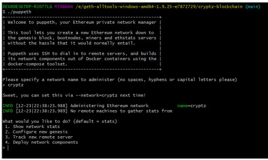

# cryptz-blockchain

The purpose of this repo is to demonstrate the setup of a private testnet network that uses **Proof of Authority** to allow for testing and exploration of the blockchain at ZBank.

Tools that will be used here are:
- Puppeth - to generate a genesis block
- GETH - a commandline tool to create keys, initialise nodes and connect nodes  

# Setting Up the Private POA Network

## Create Accounts

create the node directories: 
> mkdir node1 node2

*create new account for node1:* 
>**$ ./geth --datadir node1/ account new**
 account 1 created:  0x06d6FA1E86dC28DCbD49d22B0A3255b783A153B5

*create new account for node2:* 
>**$ ./geth --datadir node2/ account new**
 

account 2 created:  0x96947332AB7ef0d231bCA8877F2e004a2BEb32d2

  

## Configure Genesis and the Network

## Initialise the Nodes

>./geth --datadir node1/ init cryptz.json  
> ./geth --datadir node2/ init cryptz.json

## Create a Boot Node
Boot node helps node discovery for network

>./bootnode -genkey boot.key  
>./bootnode -nodekey boot.key -verbosity 9 -addr :30310

<i>enode://56762102f38a79c15bfabf80df53b60dba16b7773f9a7c24c68e358e8fb9ce5bc8ef8e2a79ceb91b2939a867262954f5f495006def87c9140a6480a8b00779d0@127.0.0.1:0?discport=30310</i>

## Start Node 1

> ./geth --datadir node1/ --syncmode 'full' --port 30311 --rpc --rpcaddr 'localhost' --rpcport 8501 --rpcapi 'personal,db,eth,net,web3,txpool,miner' --allow-insecure-unlock --bootnodes 'enode://a7613f923301c886f1bbb3da61cb0fc7ab4a698cde765ff61fc56601748496d6b2609c6f48cde3e43b158b97e5c623e94ddf2bd44dfd09552b4629da16618ec2@127.0.0.1:30310' --networkid 1515 --gasprice '1' -unlock '0x06d6FA1E86dC28DCbD49d22B0A3255b783A153B5' --password node1/password.txt --mine

## Start Node 2

> ./geth --datadir node2/ --syncmode 'full' --port 30312 --rpc --rpcaddr 'localhost' --rpcport 8502 --rpcapi 'personal,db,eth,net,web3,txpool,miner' --allow-insecure-unlock --bootnodes 'enode://a7613f923301c886f1bbb3da61cb0fc7ab4a698cde765ff61fc56601748496d6b2609c6f48cde3e43b158b97e5c623e94ddf2bd44dfd09552b4629da16618ec2@127.0.0.1:30310' --networkid 1515 --gasprice '0' -unlock '0x96947332AB7ef0d231bCA8877F2e004a2BEb32d2' --password node2/password.txt --mine

## Visualising the Boot Node

## Connecting the Private Network with MetaMask

## Directory Structure
Below is how our directory structure should look:

## Sending Transactions

